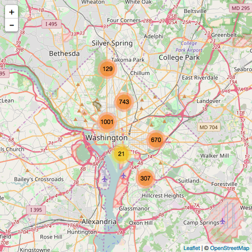

DC Crime Map - Pitch - Developing Data Products Week 4
========================================================
author: Neil Kutty
date: June 12, 2017
autosize: true

Why is a DC Crime Map Useful?
========================================================
### The Usefulness of Summary Stats with a Map View.
<br>

+ This map allows for the user to not only see clusters of recent crimes in the city, but they also get updatable set of summary statistics for the viewable area of the map.

+ Getting instant visual statistics for basic counts for the viewable area of the map allows a user to instantly retrieve additional insight while exploring the map.

+ The user gets access to the underlying table for all map points and charts, and the data explorer tab also filters to show only the viewable area; therefore, driving down to detail of what the user is looking at is as easy as going to the data explorer tab.


Getting and Cleaning the dataset
========================================================
<font size=4>

```r
library(dplyr)
library(tidyr)
library(jsonlite)
library(lubridate)
library(leaflet)
# Fig. 1 

########---------------------------------------------------------------------#>>>
  ## Retrieve the data in JSON format from opendata.dc.gov using fromJson()
  dccrimejsonlite <- fromJSON('http://opendata.dc.gov/datasets/dc3289eab3d2400ea49c154863312434_8.geojson')
  ## use cbind() combine the list elements and create a dataframe
  dc_crime_json <- cbind(dccrimejsonlite$features$properties,dccrimejsonlite$features$geometry)

  ## Seperate and clean lat/long columns but keep original datetime column
  ## --also separate REPORTDATETIME column
  dc_crime_clean <- dc_crime_json %>% 
    separate(coordinates, into = c("X", "Y"), sep = ",")%>%
    separate(REPORT_DAT, into = c("Date","Time"), sep="T", remove = FALSE)%>%
    mutate(Weekday = weekdays(as.Date(REPORT_DAT)),
           DATETIME = ymd_hms(REPORT_DAT, tz='America/New_York'),
           Date = as.Date(Date),
           X = as.numeric(gsub("c\\(","",X)),
           Y = as.numeric(gsub("\\)","",Y)))
```
</font>
***
Cleaned Data

```r
head(dc_crime_clean)
```

```
       CCN               REPORT_DAT       Date          Time    SHIFT
1 07093973 2017-06-03T12:54:27.000Z 2017-06-03 12:54:27.000Z      DAY
2 17086348 2017-05-23T04:00:38.000Z 2017-05-23 04:00:38.000Z MIDNIGHT
3 17086362 2017-05-23T04:34:23.000Z 2017-05-23 04:34:23.000Z MIDNIGHT
4 17086369 2017-06-02T21:06:11.000Z 2017-06-02 21:06:11.000Z  EVENING
5 17086372 2017-05-23T06:37:04.000Z 2017-05-23 06:37:04.000Z MIDNIGHT
6 17086377 2017-05-23T10:33:52.000Z 2017-05-23 10:33:52.000Z      DAY
  METHOD      OFFENSE                                   BLOCK XBLOCK
1 OTHERS THEFT F/AUTO        2900 - 2999 BLOCK OF N STREET NW 394912
2 OTHERS  THEFT/OTHER    400 410  BLOCK OF DIVISION AVENUE NE 406362
3 OTHERS  THEFT/OTHER 1922 - 1949 BLOCK OF MICHIGAN AVENUE NE 401872
4 OTHERS THEFT F/AUTO   600 - 699 BLOCK OF PRINCETON PLACE NW 398250
5 OTHERS THEFT F/AUTO     3400 - 3499 BLOCK OF 23RD STREET SE 402462
6 OTHERS THEFT F/AUTO      1000 - 1099 BLOCK OF 4TH STREET NW 398597
  YBLOCK WARD ANC DISTRICT PSA NEIGHBORHOOD_CLUSTER BLOCK_GROUP
1 137666    2  2E        2 206            Cluster 4    000100 4
2 136414    7  7C        6 608           Cluster 31    007804 2
3 141994    5  5B        5 503           Cluster 20    009503 1
4 140872    1  1A        4 409            Cluster 2    003200 1
5 130962    8  8B        7 704           Cluster 38    007409 2
6 137252    6  6E        1 103            Cluster 8    004701 2
  CENSUS_TRACT VOTING_PRECINCT   XCOORD   YCOORD LATITUDE LONGITUDE
1       000100      Precinct 5 394933.0 137682.5 38.90684 -77.05866
2       007804     Precinct 97 406381.8 136405.8 38.89555 -76.92666
3       009503     Precinct 67 401881.9 141961.8 38.94584 -76.97841
4       003200     Precinct 43 398210.2 140886.0 38.93573 -77.02018
5       007409    Precinct 116 402530.4 131062.8 38.84646 -76.97164
6       004701      Precinct 1 398612.2 137225.0 38.90312 -77.01617
                        BID               START_DATE
1                      <NA> 2017-06-03T11:54:03.000Z
2                      <NA> 2017-05-23T02:47:18.000Z
3                      <NA> 2017-05-23T04:06:18.000Z
4                      <NA> 2017-05-22T21:00:09.000Z
5                      <NA> 2017-05-23T05:45:08.000Z
6 MOUNT VERNON TRIANGLE CID 2017-05-23T05:15:11.000Z
                  END_DATE OBJECTID  type         X        Y  Weekday
1 2017-06-03T11:55:05.000Z 37068468 Point -77.05866 38.90685 Saturday
2 2017-05-23T04:00:36.000Z 37257960 Point -76.92666 38.89556  Tuesday
3 2017-05-23T04:07:17.000Z 37257961 Point -76.97841 38.94585  Tuesday
4 2017-05-23T05:00:04.000Z 37257962 Point -77.02019 38.93574   Friday
5 2017-05-23T06:37:03.000Z 37257963 Point -76.97164 38.84646  Tuesday
6 2017-05-23T06:55:13.000Z 37257964 Point -77.01618 38.90313  Tuesday
             DATETIME
1 2017-06-03 08:54:27
2 2017-05-23 00:00:38
3 2017-05-23 00:34:23
4 2017-06-02 17:06:11
5 2017-05-23 02:37:04
6 2017-05-23 06:33:52
```

Rendered Leaflet Map
===
<font size='5'>

```r
points <- cbind(dc_crime_clean$X,dc_crime_clean$Y)
leaflet() %>%
  addProviderTiles("OpenStreetMap.Mapnik",
                   options = providerTileOptions(noWrap = TRUE)
  ) %>%
  addMarkers(data = points,
             popup = paste0("<strong>Report Date: </strong>",
                            dc_crime_clean$DateClean,
                            "<br><strong>Offense: </strong>", 
                            dc_crime_clean$OFFENSE, 
                            "<br><strong>method: </strong>", 
                            dc_crime_clean$METHOD,
                            "<br><strong>shift: </strong>",
                            dc_crime_clean$SHIFT,
                            "<br><strong>blocksite address: </strong><br>",
                            dc_crime_clean$BLOCKSITEADDRESS
             ),
             clusterOptions = markerClusterOptions()
  ) 
```
</font>
***


Conclusion: A Crime Map with Summary Stats
===

Why is a Crime Map with Summary Stats useful?. Pitch Summary:

+ Immediately visualizing the summary stats of a viewable area allows the user to get on-demand insight summary statistics while exploring the map.

+ The underlying data is always a click away on the Data Explorer tab and filters for the viewable area of the map.
